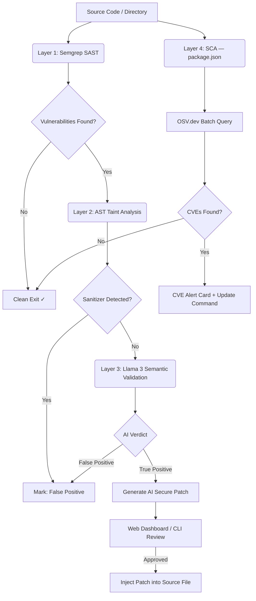

# CypherGuard AI — Enterprise SAST + SCA Platform

CypherGuard AI is an Enterprise-grade, **Local-First** security auditing platform that combines **SAST** (Static Application Security Testing) and **SCA** (Software Composition Analysis) in a unified multi-layer pipeline. It leverages local Large Language Models (LLMs) for contextual vulnerability validation, ensuring that your proprietary code **never leaves your machine**.

---

## Executive Summary

Traditional SAST tools generate overwhelming amounts of False Positives, causing alert fatigue in AppSec and development teams. CypherGuard AI addresses this with an autonomous auditing pipeline that:

- **Detects** vulnerabilities in your code (CWEs) via Semgrep + AST Taint Analysis.
- **Validates** contextually using a locally-running LLM (Llama 3 via Ollama).
- **Audits dependencies** for known CVEs (Common Vulnerabilities and Exposures) via the OSV.dev API.
- **Remediates** automatically by injecting AI-generated secure patches directly into the source file.

All of this operates **100% offline** for code analysis. The only external call is the CVE lookup, which transmits only package names and versions — never source code.

---

## Architectural Overview

The platform enforces a strict **Defense-in-Depth** strategy with 4 sequential analysis layers.



### Layer Details

| Layer | Component | Role |
| :--- | :--- | :--- |
| **Layer 1** | **Semgrep Core** | High-velocity AST-based scanning using `auto`, `p/security-audit`, and `p/javascript` rulesets. Identifies CWEs such as Command Injection, Path Traversal, XSS, SQLi, and Weak Hashing. |
| **Layer 2** | **Acorn AST Analyzer** | Parses suspicious snippets into Abstract Syntax Trees to detect sanitization functions (`DOMPurify`, `escape()`, `.replace()`), proactively eliminating false positives before reaching the AI layer. |
| **Layer 3** | **Llama 3 via Ollama** | Local LLM acting as a Senior Security Auditor. Uses structured dual-phase prompt engineering to return a JSON verdict (`True/False Positive`, severity, explanation) and a drop-in replacement patch for confirmed threats. Executed sequentially to prevent hardware overload. |
| **Layer 4** | **SCA Scanner (OSV API)** | Reads `package.json`, sanitizes semver strings, and performs a batch query against `api.osv.dev`. Returns CVE IDs, severity, summary, and recommended update command for vulnerable third-party dependencies. |

---

## Technology Stack

| Category | Technologies |
| :--- | :--- |
| **Runtime & Language** | Node.js (v18+), TypeScript |
| **Static Analysis** | Semgrep (AST-based), Acorn, Acorn-walk |
| **Artificial Intelligence** | Ollama (Llama 3 / Mistral), LangChain, Dual-Phase Prompt Engineering |
| **Dependency Auditing** | OSV.dev API (Google Open Source), CVE/NVD Database |
| **Web Server** | Express.js (REST API: `/api/scan`, `/api/apply`) |
| **Dashboard UI** | Vanilla JS, Tailwind CSS, Liquid Glass Design System, Iconify |
| **CLI Interface** | Inquirer.js |

---

## Usage

CypherGuard AI operates in two modes: **CLI** (pipeline-friendly) and **Web Dashboard** (visual audit interface).

### Prerequisites

- Node.js v18+
- Python with Semgrep installed: `pip install semgrep`
- Ollama running locally with Llama 3: `ollama pull llama3`

### Installation

```bash
git clone https://github.com/vrsebeatriz/CypherGuard-IA.git
cd CypherGuard-IA
npm install
npm run build
```

### Mode 1 — CLI

```bash
# Read-only analysis
node dist/index.js scan "path/to/target"

# Analysis with autonomous patching
node dist/index.js scan "test/more_vulnerabilities.js" --apply
```

### Mode 2 — Web Dashboard

```bash
npm run ui
```

Navigate to **`http://localhost:3000`**. The dashboard allows you to:

- Specify a file or directory path for scanning.
- Visualize **SAST alerts** (code vulnerabilities) with AI explanations and secure patches.
- Visualize **SCA alerts** (CVE-flagged dependencies) with update recommendations.
- Apply AI-generated patches directly to the source file with a single click.

---

## System Configuration

Customize operational parameters in `cypherguard.yml` at the project root:

```yaml
# cypherguard.yml
ollama:
  baseUrl: http://127.0.0.1:11434
  model: llama3:8b        # Also supports 'mistral' or any other local model
  temperature: 0          # Enforces deterministic, reproducible output
rules:
  - auto
  - p/javascript
  - p/nodejs
  - p/security-audit
```

---

## Supported Vulnerability Types

| Type | Layer | Examples |
| :--- | :--- | :--- |
| Command Injection | SAST (L1 + L3) | `exec()` with unsanitized input |
| Path Traversal | SAST (L1 + L3) | `fs.readFile()` with user-controlled path |
| XSS | SAST (L1 + L3) | Direct `res.send()` with unescaped HTML |
| SQL Injection | SAST (L1 + L3) | String-concatenated SQL queries |
| Weak Hashing | SAST (L1 + L3) | `crypto.createHash('md5')` |
| Insecure Deserialization | SAST (L1 + L3) | `node-serialize.unserialize()` |
| Sensitive Data Exposure | SAST (L1 + L3) | `res.json(process.env)` |
| Dependency CVEs | SCA (L4) | Any package in `package.json` with a known OSV/CVE entry |

---

## Project Structure

```
CypherGuard-IA/
├── src/
│   ├── server.ts          # Express server: orchestrates all scan layers
│   ├── ai/
│   │   └── ollama.ts      # LLM client with dual-phase prompt engineering
│   ├── analyzer/
│   │   └── ast.ts         # AST taint analyzer (Layer 2 false-positive filter)
│   ├── scanner/
│   │   ├── semgrep.ts     # Semgrep SAST runner (Layer 1)
│   │   ├── sca.ts         # SCA + OSV API CVE scanner (Layer 4)
│   │   └── patcher.ts     # Source file patch injector
│   ├── config/
│   │   └── loader.ts      # cypherguard.yml config loader
│   └── types/
│       └── index.ts       # TypeScript interfaces (UnifiedAlert, SCAResult, etc.)
├── public/
│   ├── index.html         # Liquid Glass dashboard shell
│   ├── style.css          # Design system (glass panels, animations)
│   └── app.js             # Frontend logic (scan, render SAST + CVE cards)
├── test/
│   ├── more_vulnerabilities.js  # Multi-vulnerability test harness
│   └── package.json             # Vulnerable dependency manifest (for SCA testing)
├── DS/
│   └── design-system.html       # Liquid Glass UI design specification
├── cypherguard.yml        # Runtime configuration
└── CypherGuard_Documentation.md # Full technical architecture document
```

---

*Built with the conviction that security analysis should be fast, private, and intelligent — without sacrificing developer experience.*
