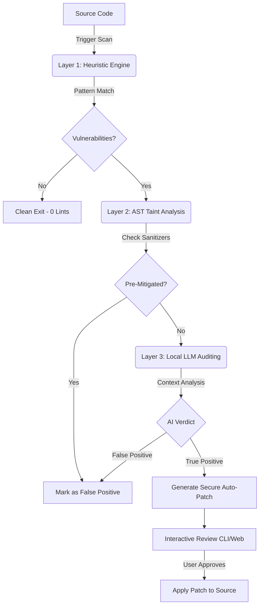

# CypherGuard AI - Enterprise SAST Platform

CypherGuard AI is an Enterprise-grade Static Application Security Testing (SAST) platform engineered for surgical precision and autonomous remediation. Built on a multi-layered architecture, it combines the speed of traditional heuristic scanning with the contextual intelligence of local Large Language Models (LLMs) to eliminate alert fatigue and automate vulnerability patching.

---

## Executive Summary

Traditional SAST tools are known for generating overwhelming amounts of False Positives, requiring extensive manual triaging by AppSec and development teams. CypherGuard AI solves this inefficiency by introducing an autonomous auditing pipeline that minimizes noise, understands code context semantically, and generates actionable, secure code replacements—all while keeping proprietary code completely secure and offline.

---

## Architectural Overview

To achieve maximum accuracy and zero-data-leakage, the platform operates on a strict, 3-Layer filtering pipeline.



### Layer Details

| Layer | Component | Description |
| :--- | :--- | :--- |
| **Layer 1** | **Semgrep Core** | High-velocity heuristic scanning engine. Sweeps the codebase using established security rulesets (e.g., OWASP, Node.js security) to identify suspicious patterns in milliseconds. |
| **Layer 2** | **Acorn AST** | Semantic analysis layer. Parses the suspicious code snippets into Abstract Syntax Trees (AST) to verify if the data flow passes through known sanitizers or type-casting functions, proactively dropping false positives. |
| **Layer 3** | **Llama 3 / Ollama** | Contextual validation. Non-mitigated alerts are sent to an offline LLM acting as a Senior Auditor. It validates the context, issues a final verdict, and generates a drop-in replacement patch. |

---

## Technology Stack

The platform is built using a modern, scalable stack designed for local execution and extensibility:

*   **Core Architecture**: Node.js, TypeScript
*   **Static Analysis Engines**: Semgrep, Acorn, Acorn-walk
*   **Artificial Intelligence**: Ollama (Llama 3, Mistral support), LangChain, JSON5 Parsing
*   **Application Interfaces**: Express.js (REST API), Inquirer (CLI)
*   **Dashboard Design System**: Tailwind CSS (Liquid Glass UI paradigm)

---

## Usage Instructions

CypherGuard AI supports dual-mode operation: a Continuous Integration-friendly Command Line Interface (CLI) and an interactive Local Web Dashboard.

### Prerequisites
*   Node.js (v18 or higher)
*   Python (with `semgrep` installed via pip)
*   Ollama installed locally and running the `llama3:8b` model.

### Installation

Clone the repository and install the required dependencies, followed by the TypeScript compilation step:

```bash
npm install
npm run build
```

### 1. Command Line Interface (CLI) Mode
Designed for pipeline integration and rapid terminal execution.

**Standard Scan:**
Executes a read-only analysis on the specified directory or file.
```bash
node dist/index.js scan "path/to/target"
```

**Autonomous Patching (Interactive):**
Appends the `--apply` flag. Upon detecting a True Positive, the system will prompt the user with a diff-like view and request authorization to inject the AI-generated secure code into the file.
```bash
node dist/index.js scan "test/vulnerable.js" --apply
```

### 2. Local Web Dashboard Mode
Provides a rich, interactive Graphical User Interface (GUI) without compromising the offline security model. 

Start the interface server:
```bash
npm run ui
```
Navigate to **`http://localhost:3000`** in your preferred browser. The dashboard allows users to specify target paths, initiate scans, review side-by-side code comparisons, and trigger file patches seamlessly.

---

## System Configuration

Advanced operational parameters can be adjusted via the `cypherguard.yml` configuration file located in the project root.

```yaml
# cypherguard.yml
ollama:
  baseUrl: http://127.0.0.1:11434
  model: llama3:8b        # Configurable to 'mistral' or other local models
  temperature: 0          # Enforces deterministic output
rules:
  - p/javascript
  - p/nodejs
  - p/security-audit
```
